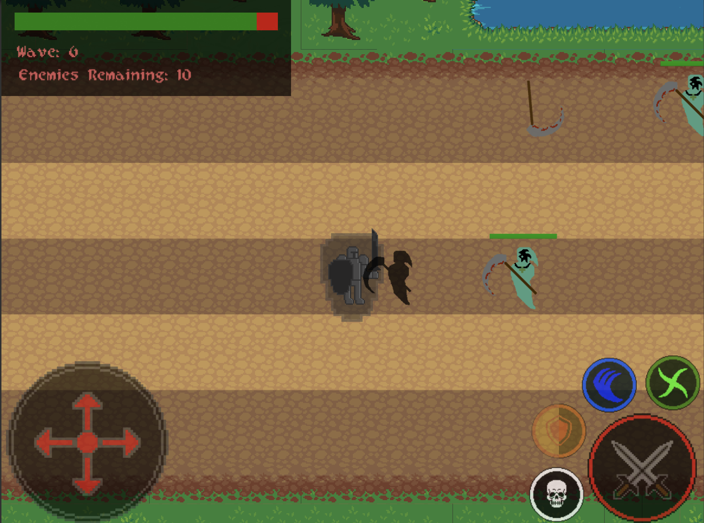
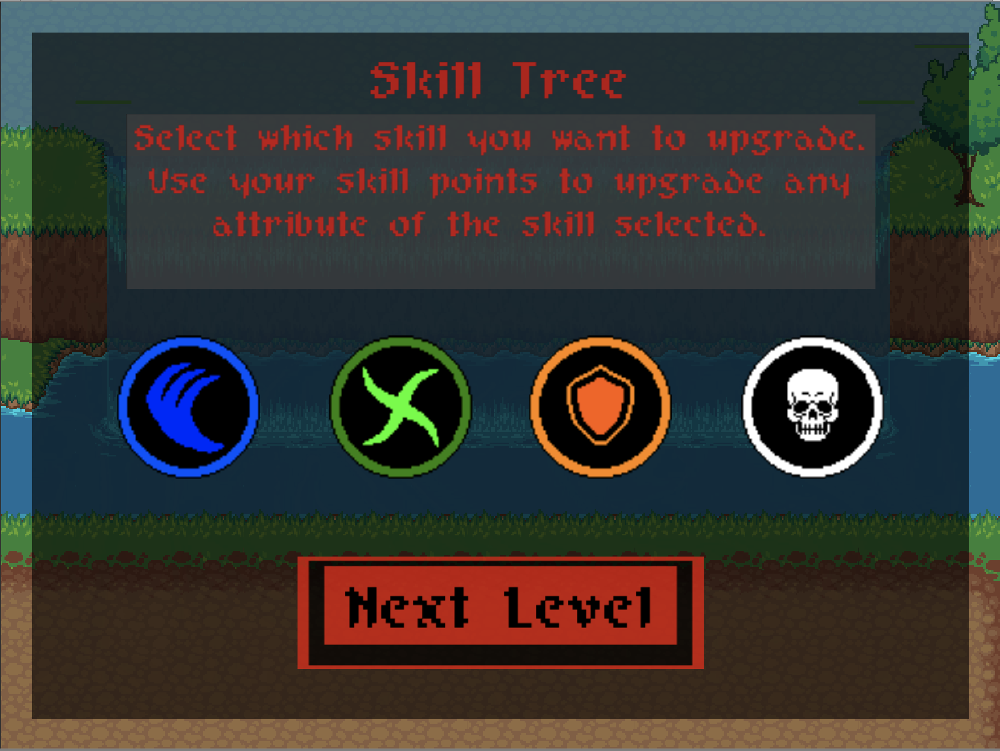

# Aegis
A lane defense game where the player moves and controls an avatar across a map with multiple lanes to 
defend against waves of enemies. The concept is similar to Plants vs Zombies, the moment an enemy reaches
the end of the map, it's game over. Built using Unity 3D and C#.

